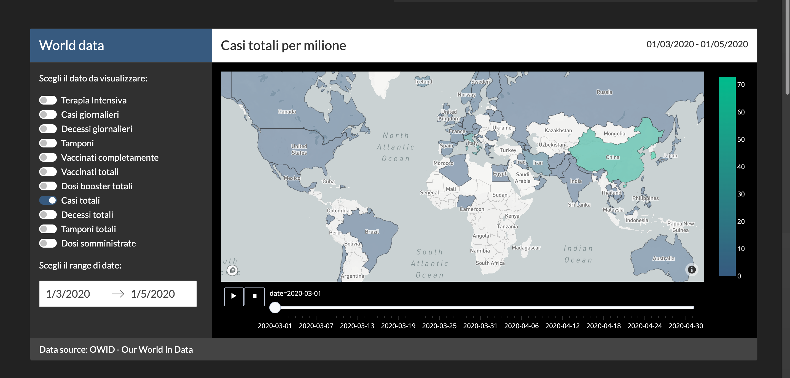
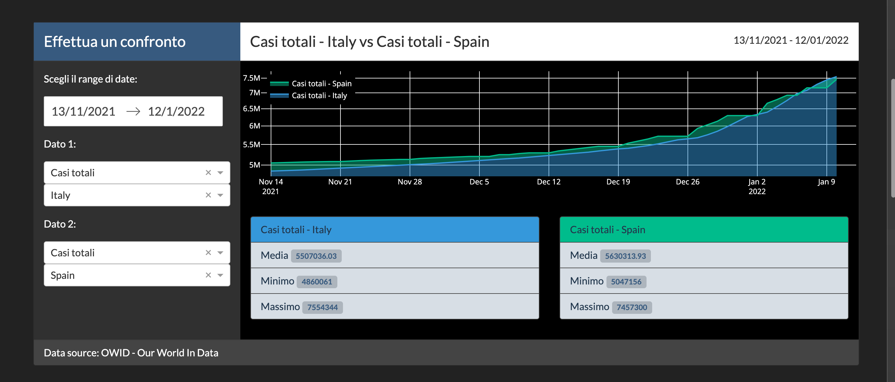
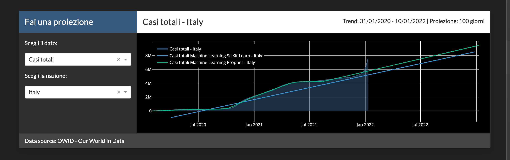

[](https://github.com/stefanospin7/Progetto_Bioinfo_PLP/actions/workflows/dataScraper.yml)

# COVVID - A COVID-19 dashboard

This is a web app, developed with Dash interactive Python framework, to analize COVID-19 data from OWID - Our World in Data dataset.

[OWID](https://github.com/owid/covid-19-data/blob/master/public/data/owid-covid-data.csv)
[Plotly](https://plot.ly/)
[Dash](https://plot.ly/dash)

## Getting Started

### Running the app locally

First create a virtual environment with conda or venv inside a temp folder, then activate it.

```
virtualenv venv

# Windows
venv\Scripts\activate
# Or Linux
source venv/bin/activate

```

Clone the git repo, then install the requirements with pip

```

git clone https://github.com/stefanospin7/Progetto_Bioinfo_PLP
cd dash-sample-apps/apps/dash-yield-curve
pip install -r requirements.txt

```

Run the app

```

python main.py

```

## About the app

This Dash app get and visualize data about COVID-19 pandemic from OWID - Our world in data dataset

## Built With

- [Dash](https://dash.plot.ly/) - Main server and interactive components
- [Plotly Python](https://plot.ly/python/) - Used to create the interactive plots

## Screenshots

The following are screenshots for the app in this repo:







## Credits

University course project
MsC in Bioinformatics, University of Tor Vergata, Rome, Italy

Students:
- Manfredo Aristide Fraccola
- Sara Giordani
- Andrea Misiti
- Alessandro Pucci
- Angela Sangiorgio
- Stefano Spinelli
- Gaia Tomei
